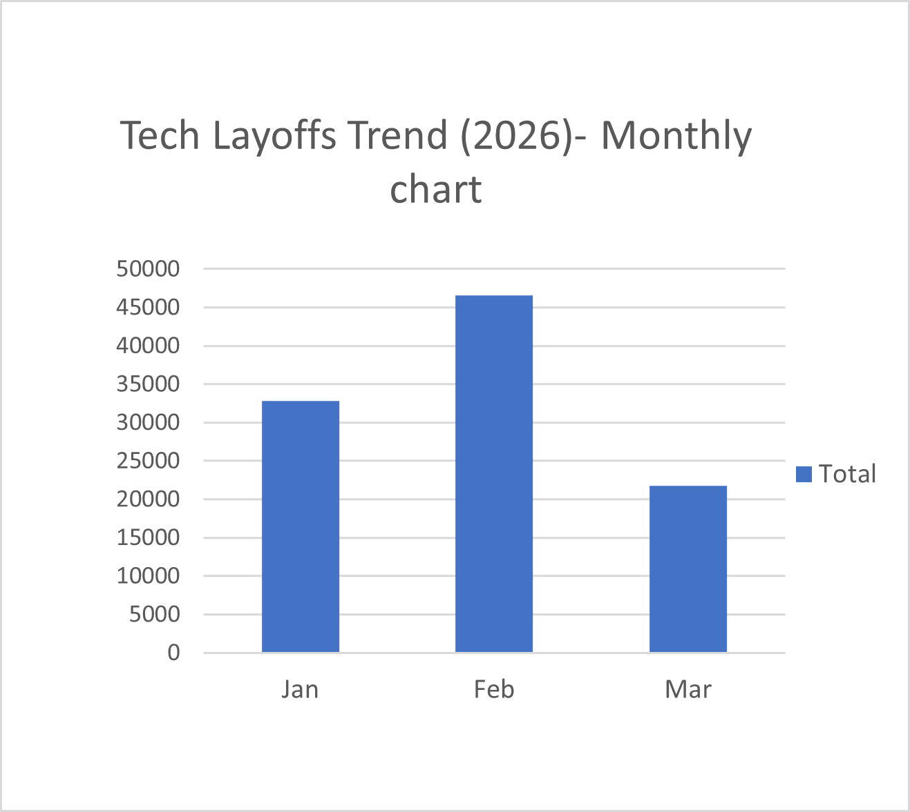
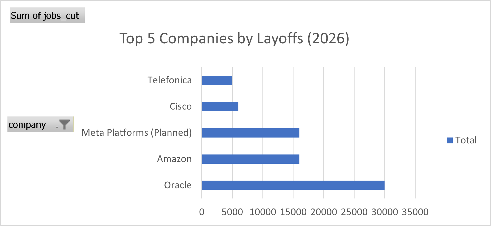

# Tech Layoffs Analysis (2026) 📊

## Objective  
To analyze layoffs data and identify trends, key contributors, and patterns across the tech industry.

---

## Tools Used  
- Microsoft Excel (Pivot Tables, Data Cleaning, Charts)

---

## Key Insights  

- Layoffs peaked in February (46,588 layoffs)  
- Oracle contributed ~65% of February layoffs  
- Layoffs were spread across multiple tech sectors  

---

## Top 5 Companies by Layoffs  

- Oracle — 30,000  
- Amazon — 16,000  
- Meta — 16,000  
- Cisco — 6,000  
- Telefonica — 5,000  

---

## Visualizations  

---

## Conclusion  

The layoffs trend shows that major spikes are driven by a few large companies, indicating concentrated impact rather than uniform decline across the industry.
